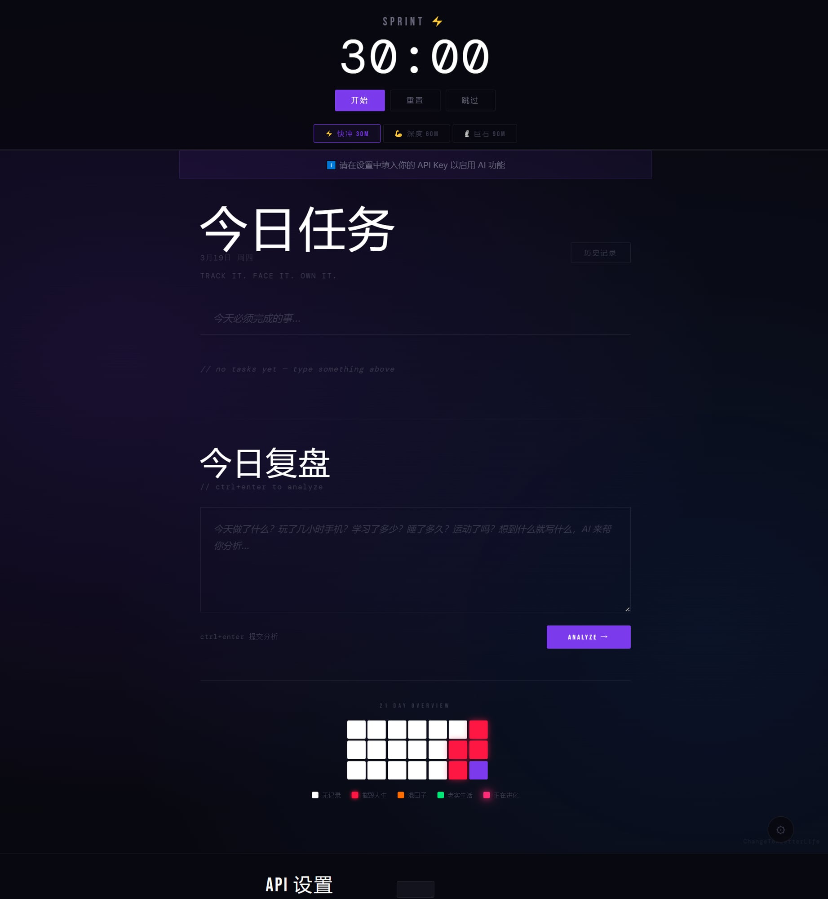
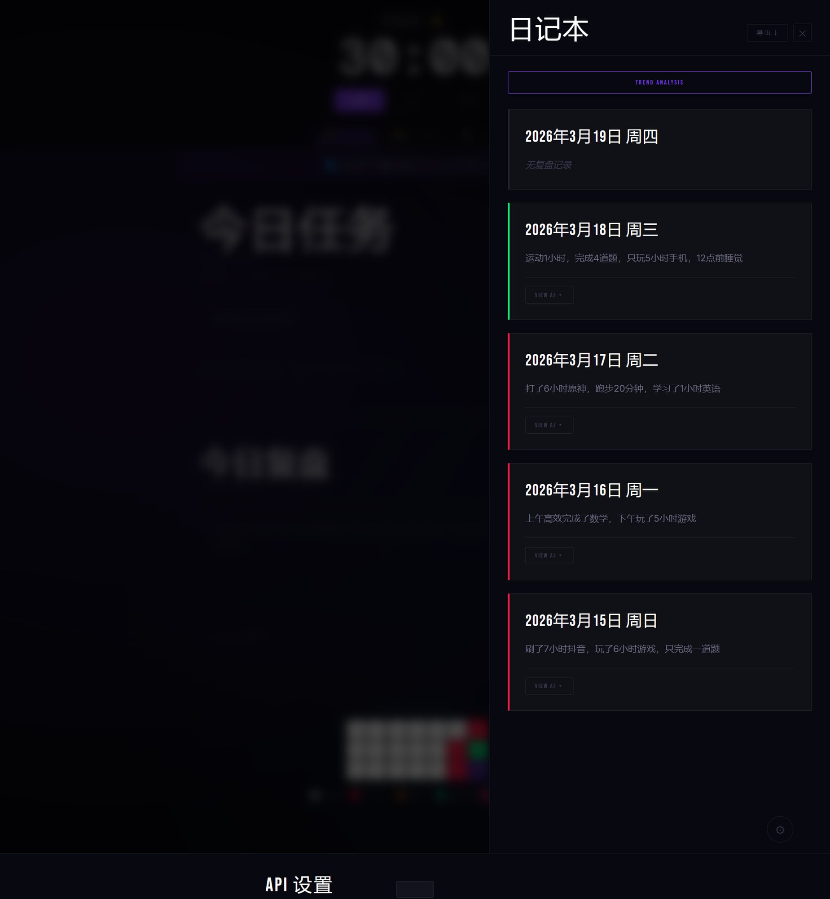

# ChangeToABetterLife

> **你不是懒。你只是没有一个真正会审判你的工具。**

大多数人知道自己在混日子。打开手机刷了3小时，然后合理化："今天累了，明天补。"

明天永远不来。

**ChangeToABetterLife** 是一个每日任务追踪 + AI 复盘分析工具。它不给你鸡汤，不给你勋章，不哄你开心。它只做一件事：**告诉你，你今天到底过了什么样的一天。**

---

## 截图 / Screenshots





---

## 功能 / Features

| 功能 | 说明 |
|------|------|
| 🎯 每日任务 | 写下今天必须完成的事，完成打勾，没完成就是没完成 |
| ⏱ 专注计时器 | 三档 Pomodoro：30m / 60m / 90m，没有自定义退路 |
| 📓 每日复盘 | 写下今天的经历，AI 给出时间分析 + 明日建议 |
| 📊 21天热力图 | 可视化你最近3周的生活质量，颜色不说谎 |
| 🤖 AI智能推荐 | 根据历史记录，每天推荐具体可执行的今日任务 |
| 📅 日记本 | 保存所有历史复盘，随时查看 AI 分析，支持导出 |

**热力图等级：**
- ⬜ 白色 = 无记录
- 🔴 红色 = 正在摧毁人生
- 🟠 橙色 = 混日子
- 🟢 绿色 = 老实生活
- 🩷 粉色 = **正在进化**

---

## 快速开始（从零开始的完整教程）

### 第一步：下载项目

**方式一：用 Git（推荐）**
```bash
git clone https://github.com/Aji-Q/ChangeToABetterLife.git
cd ChangeToABetterLife
```

**方式二：直接下载 ZIP**
点击页面右上角绿色 **Code** 按钮 → **Download ZIP** → 解压到任意文件夹

---

### 第二步：安装 Python

> 如果你已经有 Python 3.8 或以上版本，跳过这步。

1. 打开 https://www.python.org/downloads/
2. 下载最新版本（点击黄色大按钮）
3. 安装时 **务必勾选 "Add Python to PATH"**（如下图）
4. 安装完成后打开终端，输入 `python --version`，看到版本号说明成功

> **Windows 用户**：按 `Win + R`，输入 `cmd`，回车，打开命令提示符  
> **Mac 用户**：按 `Cmd + Space`，输入 `Terminal`，回车

---

### 第三步：安装依赖

在终端里，先进入项目文件夹：

```bash
# Windows 示例（把路径换成你自己的）
cd C:\Users\你的用户名\Downloads\ChangeToABetterLife

# Mac / Linux 示例
cd ~/Downloads/ChangeToABetterLife
```

然后安装依赖：

```bash
pip install -r requirements.txt
```

> 如果提示 `pip` 找不到，试试 `pip3 install -r requirements.txt`

---

### 第四步：启动服务器

```bash
python server.py
```

> 如果提示 `python` 找不到，试试 `python3 server.py`

看到类似这样的输出说明启动成功：
```
======================================
  ChangeToABetterLife
  Open: http://localhost:9527
======================================
```

> ⚠️ **重要：这个终端窗口必须保持开着。** 关掉它 AI 功能就停了。

---

### 第五步：打开浏览器

浏览器地址栏输入：

```
http://localhost:9527
```

---

### 第六步：配置 API Key

点击页面右下角的 **⚙ 齿轮图标** → 输入你的 API Key → 点 SAVE。

**如何获取 API Key：**

| 服务 | 地址 | 说明 |
|------|------|------|
| Anthropic (Claude) | https://console.anthropic.com | 注册后在 API Keys 页面创建 |
| OpenAI (GPT) | https://platform.openai.com | 注册后在 API Keys 页面创建 |

> 💰 **关于费用**：API Key 按使用量计费，不是订阅制。每次 AI 分析大约消耗 $0.001（约0.007元人民币），日常使用费用极低。新用户通常有免费额度。

---

## 使用建议

1. **早上**：看 AI 推荐，把今天要做的事填进任务列表
2. **做事时**：开计时器，专注25-90分钟
3. **睡前**：在"今日复盘"写今天发生了什么，点 ANALYZE，看 AI 怎么说
4. **坚持**：21天热力图会让你看见自己的变化

---

## 数据与隐私

- 所有数据存储在你的**浏览器本地**（localStorage）
- 数据**不会上传到任何服务器**，只在你自己的电脑上
- 你的复盘文字会发送给 Anthropic 或 OpenAI 的 API 进行分析（和正常使用 Claude/ChatGPT 一样）
- 关电脑重启不影响数据；但清除浏览器缓存会删掉数据，建议定期点"导出 ↓"备份

---

## 常见问题

**Q: 打开 http://localhost:9527 显示"无法访问此网站"？**  
A: server.py 没有运行，回到第四步重新启动。

**Q: 点 ANALYZE 没有反应或报错？**  
A: 检查右下角 ⚙ 里的 API Key 是否已填写并保存。

**Q: pip install 报错？**  
A: 尝试 `pip3 install -r requirements.txt`，或者确认 Python 安装时勾选了 PATH。

**Q: 换了台电脑，历史记录没了？**  
A: localStorage 是浏览器本地存储，不跨设备同步。记得用"导出 ↓"备份。

---

## 写在最后

这个工具不会让你变好。

**你的行动才会。**

但至少，它会让你没法再对自己撒谎。

---

## License

MIT — 随便用，随便改，给个 ⭐ Star 就是最好的反馈。

*Made with frustration and too many wasted evenings.*
